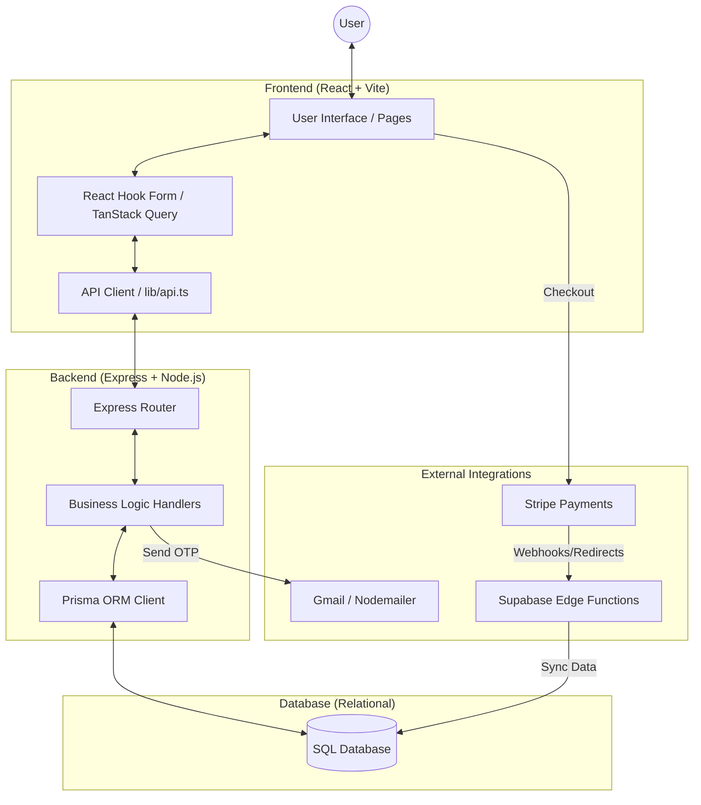
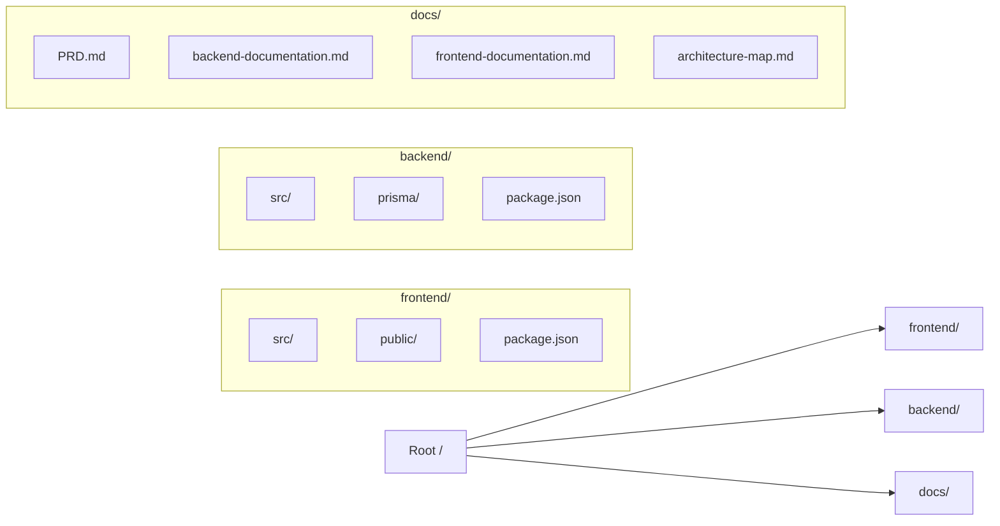
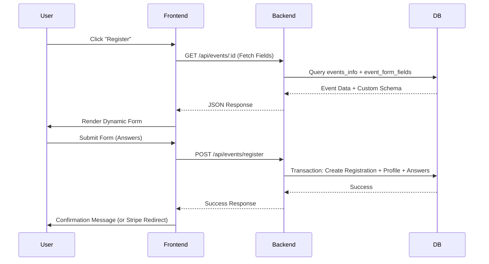
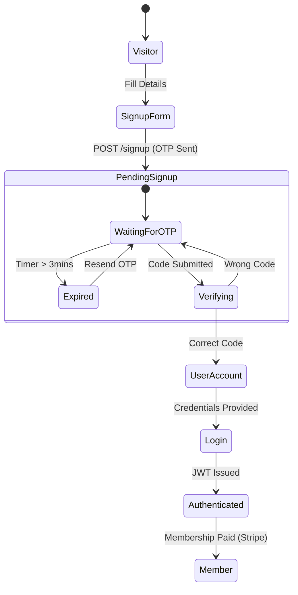

# Project Architecture Map

This document provides a visual and structured map of the LUMS website architecture, representing the interaction between the frontend, backend, database, and external services.

## 1. High-Level System Overview

The application follows a modern client-server architecture, decoupled into a frontend SPA and a backend REST API.

---

## 2. Monorepo (Workspaces) Structure

As per the latest restructuring into **npm workspaces**, the project is organized to isolate concerns while sharing a root environment.

---

## 3. Data Flow: Event Registration

This map shows how data moves from a user's click to the persistent database.

---

## 4. Authentication State Machine

The logic governing how a visitor becomes a verified student member.

---

## 5. Security & Isolation Layer

- **CORS Protection**: Access is restricted to trusted origins.
- **Stateless Auth**: JWT eliminates the need for server-side sessions, ensuring better scalability.
- **ORM abstraction**: Prisma acts as a type-safe bridge, preventing raw SQL injection and ensuring schema consistency.
- **Validation**: Shared logic via Zod schemas ensures data integrity at both ends (Frontend UI and Backend Handlers).
